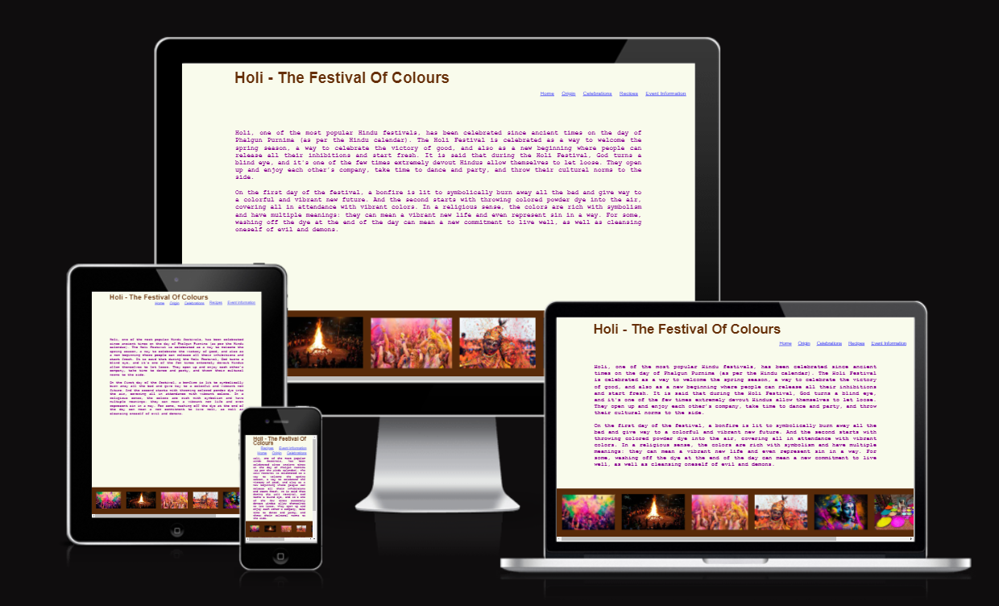
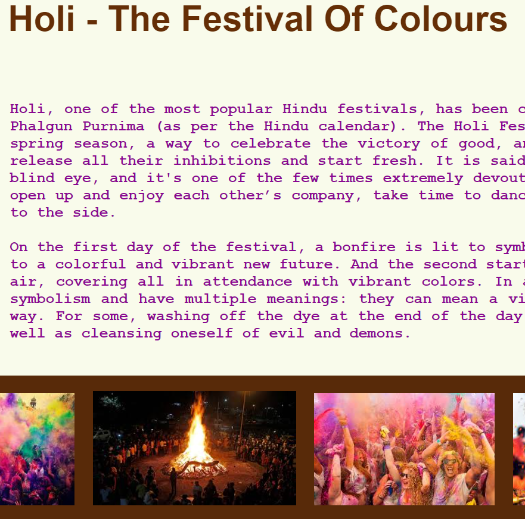
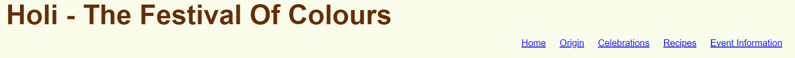
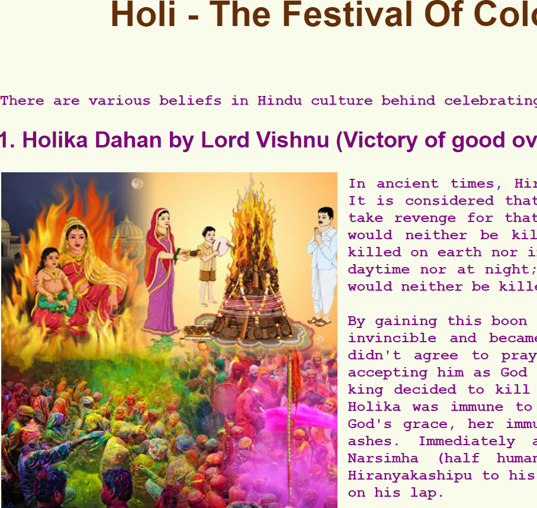
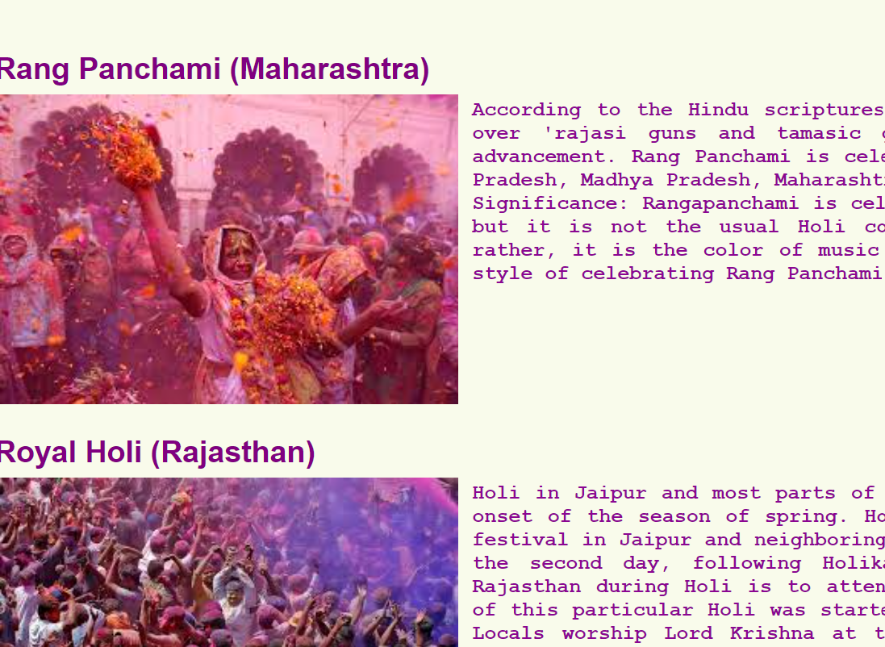
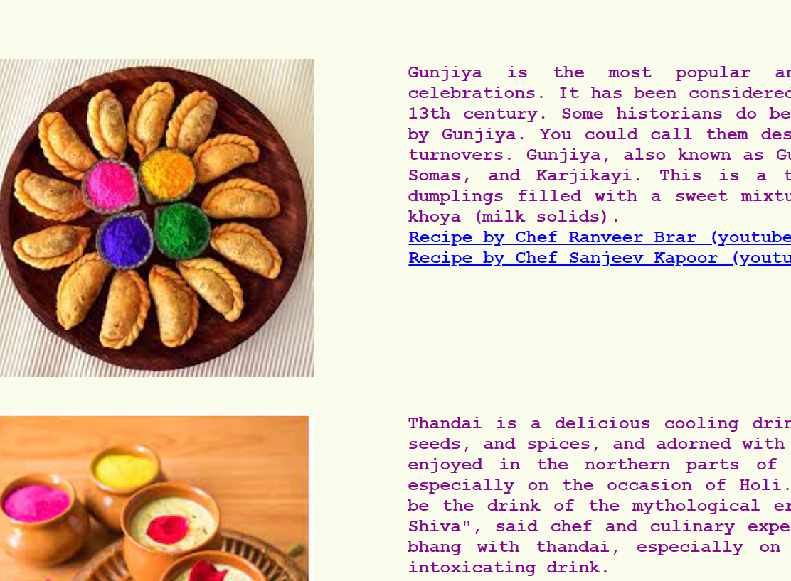
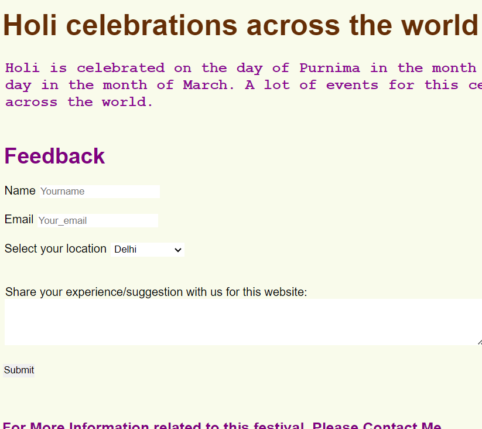

# Holi - The festival of colors

This website is the place for information related to one of the most popular Indian festivals, Holi. Here I try to add all relevant information related to this festival, for example, what this festival is, why it is celebrated, how one can celebrate it, what preparations are required, where one can join others in this celebration, etc. 

One can find most of the information related to this festival by visiting various websites. But couldn't find a single websitethat could  provide complete information related to this at one place. So I thought to create a one-stop place for such information to make it easier for anyone who is intersted in it. On this website, I used information from various places, including public websites, religious books, and my own self-knowledge.

# Features
This is an informational website. On this website, information is grouped as per relevance and placed on different pages. The home page has general detail about what the this festival is about.I also added some relevant images at the bottom of the page as a scroll bar. In this scroll bar section, more pictures can be added anytime by just placing smiliar code under the footer section on the index page.
 
| {:height="100px" width="100px"}
## Navigation Bar
The navigation bar has links to all the pages in this website and follows the same structure on all the pages. So basically, users can jump to any page from anywhere while browsing information here. Navigation menu name are self-explanatory and precise. 

## Origin Page
Here is bit of insight from a historic point of view for this festival as to why it is being celebrated and probably since when as well. There are various versions of these stories and many of them are very different. On this website,the most famous and widely accepted theories behind the celebration of this festival are only added to avoid any possible dispute.

## Celebrations Page
Across the world, this festival is celebrated in various ways. And even in India, where it is celebrated most, there are different ways to celebrate as per locallity. This is what is placed under this page,along with the name of celebration method, the area name, and how they celebrate it.

## Recipe Page
Food is one of the main part of celebration, especially in India. Also, there is some special food for each celebration, which can be seen as signature item. This page has not only inforamtion related to holi specific food items but also a bit of a deeper glance at what this food item is as well as Youtube links for recipes.

## Event Information Page
Despite all of my efforts, I agree that there is always a big scope of improvement. Some of those I already figured out and mentioned in the section "Roadmap" under this document. But I also created this page so that more feedback can be shared with me on this website, making it a great repository of inforamtion for this festival.

 
# Roadmap:

Currently,this website is for internal use and is limited to HTML and CSS as technologies. In the future,we would like to enhance this as follows:
- Update the information on the Preparations page, as food is just one part of preparation, though it is most important.
- Upgrade the site for search criteria with the events filtering.
- Add section for live feedback, inputs, or suggestions from users.
- Add registration and login possibilities for users from around the world to contribute here.
- Add functionality to send event information to registered users.
- Cater the event registration process through this website for events around the world.

# Acknowledgement:

I took help from training material provided by the Code Institute when preparing this website. Along with that, big community of developers from the Code Institute and my mentor were very helpful in supporting me time to time during the development phase.

# Quality Checks

I tried to perform thorough testing before deploynig this website. Soome highlights from testing are:

## Testing Areas
- Functional Tests: Verified if all the links are working as expected on all the pages.
- GUI Tests: All the information should be accessible, readable on all the pages. Also, on different screens, information should be displayed in an easily readable format.

## Defects
I came accross with various bugs while testing and managed to fix all of them by the end. Some of them are listed here.
- Scroll bar had images with deifferent size -> Resized each of them to bring all at same size
- Images and respective text was not appearing inline -> Fixed that by dividing the screen into rows and columns.
- Feedback form submisson was not popping in a new tab -> Fixed that with a slight change.

# Project Status:

In its current status, this website is functioning for the targeted local execution. As well, this is ready for launch on the WWW. High-level enhancements for fututre are metioned in the roadmap, which are not mandatory, of course, but will provide more value to the website.

# Validator Testing

HTML =
        No errors were returned when passing through the official [W3C validator](https://validator.w3.org)

CSS =
        No errors were found when passing through the official [Jigsaw validator](https://jigsaw.w3.org/css-validator )
        

# Deployment Steps

This game website is deployed to Github page, and steps for the same are as follows:
- Go to Github repository
- Navigate to Settings
- Go to Code and Automation -> Pages tab
- Select Main Branch and click on save

The Working link to the website is here: https://pallavigoel1.github.io/Pallavi_Project1/

## Credits 

I fetched help for coding from tutorial provided by Code Institute, W3 Schools, and Slack community.

Also, the images are captured from open libraries.

## Media

- The photos used on the Home and Game page are from Google Images
# Disclaimer:

Images used in this website is fetched from various website available on internet today. 
